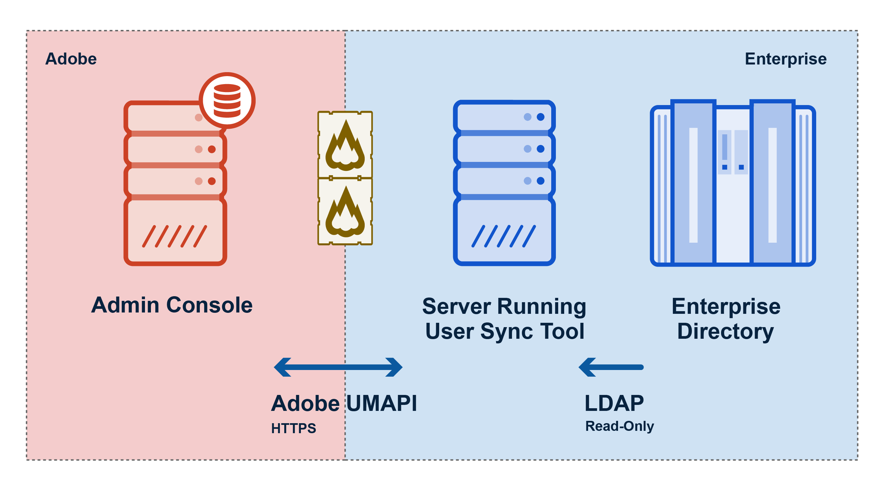

Version 2.7.1, released 2022-03-22

This document has all the information you need to get up and
running with User Sync. It presumes familiarity with the use of
command line tools on your local operating system, as well as a
general understanding of the operation of enterprise directory
systems.

# Introduction

## In This Section
{:."no_toc"}

* TOC Placeholder
{:toc}

---

[Next Section](setup_and_installation.md)

---

User Sync, from Adobe, is a command-line tool that moves user and
group information from your organization's LDAP-compatible
enterprise directory system (such as Active Directory) to the
Adobe User Management system.

Each time you run User Sync it looks for differences between the
user information in the two systems, and updates the Adobe
directory to match your directory.

## Prerequisites

The User Sync Tool is a command-line application. Run it in a shell
terminal or in a shell script. It is self contained and does not require
any additional tools to be installed to the system.

The User Sync tool is a client of the User Management API
(UMAPI). In order to use it, you must first register it as an API
client in the [Adobe I/O console](https://www.adobe.io/console/),
then install and configure the tool, as described below.

The operation of the tool is controlled by local configuration
files and command invocation parameters that provide support for
a variety of configurations. You can control, for example, which
users are to be synced, how directory groups are to be mapped to
Adobe groups and product configurations, and a variety of other
options.

The tool assumes that your enterprise has purchased Adobe product
licenses. You must use the
[Adobe Admin Console](https://adminconsole.adobe.com/enterprise/) to define
user groups and product configurations. Membership in
these groups controls which users in your organization can access
which products.

## Operation overview

User Sync communicates with your enterprise directory through
LDAP protocols. It communicates with Adobe's Admin Console
through the Adobe User Management API (UMAPI) in order to update
the user account data for your organization. The following figure
illustrates the data flow between systems.

Each time you run the tool:

- User Sync requests employee records from an enterprise
directory system through LDAP.
- User Sync requests current users and associated product
configurations from the Adobe Admin Console through the User
Management API.
- User Sync determines which users need to be created, removed,
or updated, and what user group and product configuration
memberships they should have, based on rules you have defined in
the User Sync configuration files.
- User Sync makes the required changes to the Adobe Admin Console
through the User Management API.

## Usage models

The User Sync tool can fit into your business model in various
ways, to help you automate the process of tracking and
controlling which of your employees and associates have access to
your Adobe products.

Typically, an enterprise runs the tool as a scheduled task, in
order to periodically update both user information and group
memberships in the Adobe User Management system with the current
information in your enterprise LDAP directory.

The tool offers options for various other workflows as well. You
can choose to update only the user information, for example, and
handle group memberships for product access directly in the Adobe
Admin Console. You can choose to update all users, or only
specified subsets of your entire user population.
In addition, you can separate the tasks of adding and updating
information from the task of removing users or memberships. There
are a number of options for handling the removal task.

For more information about usage models and how to implement
them, see the [Usage Scenarios](usage_scenarios.md#usage-scenarios) section below.

---

[Next Section](setup_and_installation.md)
